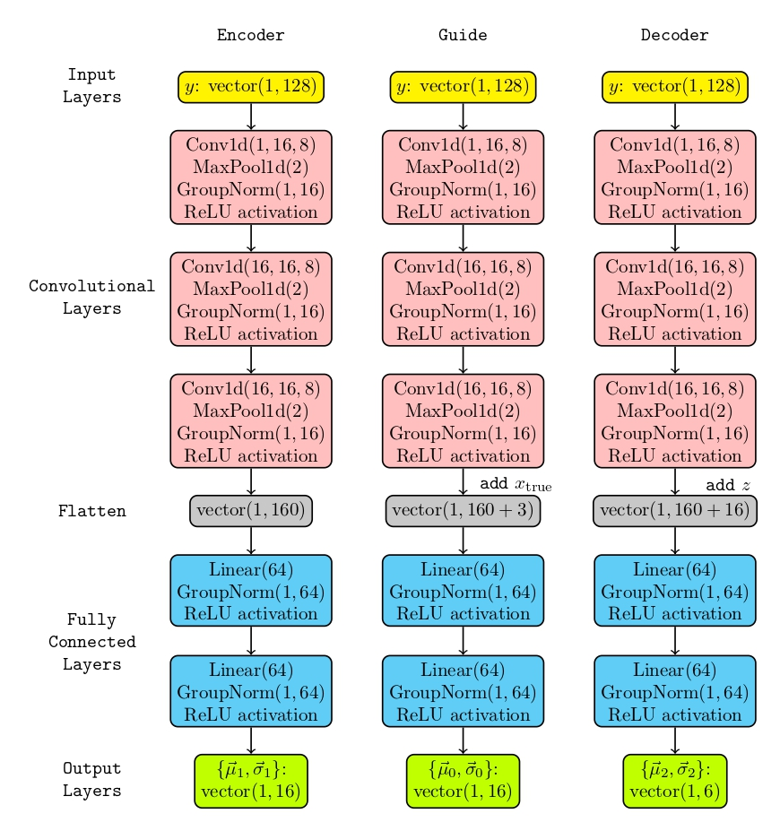
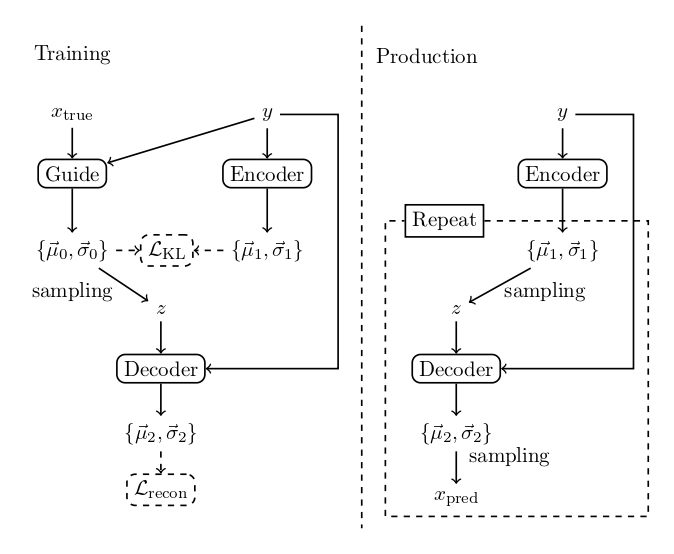

# Merger_Ringdown_Test
This repository contains the codes used for the paper

[__arXiv link to be added after submission__].

The main codes are contained in the [Modules](Modules/) folder:
- [Ringdown2.py](Modules/Ringdown2.py): contains the routines to generate ringdown waveforms and compute their signal-to-noise ratio w.r.t. a noise curve; by default, ringdown frequencies and damping times are generated by interpolation from the corresponding `.dat` files (we used the tabulated data publicly available at [pages.jh.edu/~eberti2/ringdown/](https://pages.jh.edu/~eberti2/ringdown/)).
- [qnm_cvae.py](Modules/qnm_cvae.py): implements the conditional variational autoencoder class, as well as the routine producing the PP-plot to evaluat the final performances of the autoencoder; the autoencoder is coded in `PyTorch`;
- [train_script.py](Modules/train_script.py): a `Python` script to train the autoencoder.

The notebook [cvae_notebook_git.ipynb](cvae_notebook_git.ipynb) is organized in sections, each section performing a different task: generate datasets, produce plots, test the network, etc. The notebook was originally run on the `Google Colab` platform.

Here below you find a flowchart of the three neural network units composing the conditional variational autoencoder. The arguments of the functions `Conv1d`, `MaxPool1d`, `GroupNorm` and `Linear` refer to the [PyTorch.nn](https://pytorch.org/docs/stable/nn.html) official documentation.

The three units are used into the training and production as illustrated in the fig.1 of the paper (also repeated here below for the reader's convenience)

